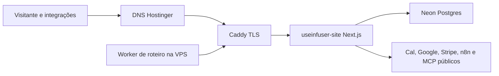

# Arquitetura: useinfuser.com na VPS

## 1. Princípios e restrições

1. Paridade antes do corte: nenhum DNS muda antes de a aplicação inteira passar no staging interno.
2. Um runtime para todas as rotas: preservar o comportamento híbrido do Next.js.
3. Segredo fora de Git e imagem: arquivo 600 e BuildKit secret.
4. Borda compartilhada sem restart: Caddy validado e recarregado.
5. Rede mínima: Caddy e site dividem apenas `useinfuser-net`.

## 2. Contexto e fronteiras

## 3. Estado atual verificado

- Vercel serve o projeto `yan-site-test`, mas a conta Hobby está pausada.
- O build base gera páginas estáticas, rotas dinâmicas, middleware e APIs.
- Caddy já ocupa 80/443 e atende os serviços da Infuser.
- O worker na mesma VPS consulta `/api/diagnostico/roteiro/fila` continuamente.
- Não existe pacote Docker de produção no repositório.

## 4. Arquitetura alvo

| Componente | Responsabilidade | Entrada/saída | Falha esperada |
|---|---|---|---|
| Hostinger DNS | Apontar apex e `www` | A/AAAA/CNAME | Cache durante propagação. |
| Caddy | TLS, compressão, headers e proxy | HTTPS -> HTTP interno | Upstream indisponível vira 502. |
| `useinfuser-site` | Next.js completo | HTTP 3000 interno | Reinício automático e healthcheck. |
| Neon | Persistência existente | TLS Postgres | App retorna erro seguro; sem fallback de dados. |
| Worker de roteiro | Consumir fila sem long-poll | GET rápido + pausa local | Backoff em 5xx/rede. |

## 5. Fluxos críticos

- Página pública: DNS -> Caddy -> Next estático/SSR -> assets.
- Lead: navegador -> API -> Neon -> resposta tipada.
- Webhook: Cal/Stripe -> Caddy -> handler -> assinatura -> transação.
- Painel: operador -> middleware CSP/auth -> Neon.
- `/time`: Next rewrite -> `mcp.useinfuser.com/st/*`, preservado.
- Worker: chamada rápida -> fila durável -> processamento local -> conclusão.

## 6. Segurança e privacidade

- Caddy termina TLS e adiciona encaminhamento padrão.
- Middleware atual continua sendo autoridade de `/leads` e `/demomarja`.
- Container roda como usuário não-root, filesystem read-only e capabilities removidas.
- Nenhuma porta do app é publicada no host.
- Segredos ficam em `/home/infuser/.config/useinfuser/useinfuser.env`, modo 600.
- Logs de smoke não contêm corpo de respostas protegidas nem valores de env.

## 7. Disponibilidade, capacidade e custo

| Dimensão | Premissa | Limite/meta | Degradação |
|---|---|---|---|
| Memória | App Next único | 1,5 GiB | Restart; Caddy retorna 502 e alerta. |
| CPU | Tráfego atual | 1,5 CPU | Latência observada; sem autoscale. |
| Disco | Imagens locais | 37 GB livres no baseline | Manter duas releases e limpar somente após prova. |
| Custo | VPS já contratada | Sem assinatura nova | Capacidade revisada se RSS/load crescerem. |

## 8. Compatibilidade, rollout e recuperação

- Deploy blue/green lógico por tag de imagem do commit.
- Antes do DNS, Caddy e app são testados pela rede interna e por `curl --resolve` quando o certificado existir.
- Backup do Caddy e valores DNS anteriores são preservados.
- Rollback de aplicação aponta Compose para a tag anterior; rollback de borda restaura Caddy; rollback de DNS restaura os registros anteriores.

## 9. Fitness functions

- Build lista o mesmo inventário de rotas públicas.
- Container não publica porta e executa como UID não-root.
- `docker compose config` e `caddy validate` passam antes de aplicar.
- Poll contínuo de 25 s é proibido por teste.
- `/api/health` identifica o release sem revelar segredo.

## 10. Divergências e decisões pendentes

| Tema | Fato | Decisão | Dono | Bloqueia? |
|---|---|---|---|---|
| Acesso DNS | Não existe API local já provada | Handoff humano se o hPanel pedir login | Yan | Apenas W4. |
| Monitor externo | Vigia definitivo segue pendente | Usar probe atual e health local nesta fatia | Yan | Não. |
