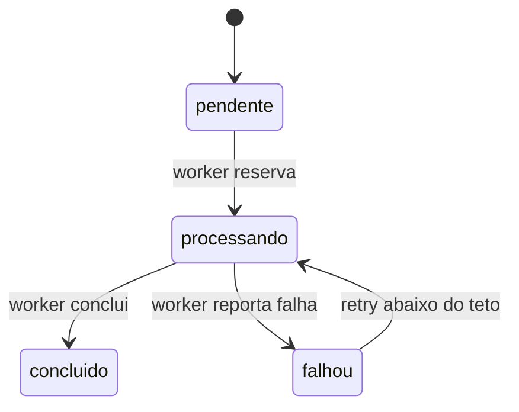

# Contratos e eventos: migração do useinfuser.com

## 1. Fronteiras

| Chamador | Chamado | Contrato preservado | Dono |
|---|---|---|---|
| Navegador | Next | URLs, HTML, assets e status | Site |
| Cal/Stripe | Webhooks | URL, assinatura, idempotência e códigos | Funil |
| Worker VPS | Fila de roteiro | Header secreto e JSON atual | Funil |
| Next | Neon/Google/Cal/n8n/MCP | Envs e TLS atuais | Integração |

## 2. Correção do contrato de fila

Estado atual: o worker solicita `?esperar=25`, a rota mantém a conexão e consulta o banco a cada 2 segundos. Isso é query longa, não evento, e foi suficiente para pausar a conta.

Contrato alvo:

- `GET /api/diagnostico/roteiro/fila` responde imediatamente.
- O header `x-roteiro-secret`, o schema JSON e a reserva transacional permanecem iguais.
- O worker espera localmente 60 segundos entre voltas bem-sucedidas.
- Erro de rede ou HTTP mantém backoff de 30 segundos.
- A fila Postgres continua sendo o log durável e a fonte de idempotência.

Não será criado evento CloudEvents nesta correção. Retrofit de barramento ampliaria o incidente sem ser necessário para restaurar o serviço. Se a fila virar integração reutilizável entre produtos, o gatilho de reconsideração é criar evento assinado `roteiro.queued.v1` com dedupe por `(source,id)` e DLQ existente.

## 3. Estado e transições

## 4. Idempotência, ordem e concorrência

- chave de negócio: `cal_booking_id`.
- reserva: `FOR UPDATE SKIP LOCKED` existente.
- retry preserva o mesmo item e incrementa tentativa na reserva.
- reserva vencida retorna ao consumo conforme regra existente.
- um único supervisor deve executar o worker.

## 5. Versionamento e compatibilidade

| Versão | Mudança | Compatibilidade |
|---|---|---|
| v1 | Resposta imediata e pausa no consumidor | Payload e auth não mudam; consumidor antigo perde apenas a espera. |

## 6. Falhas e erros tipados

| Código/status | Significado | Retry | Remediação |
|---|---|---:|---|
| 401 | Segredo ausente/incorreto | Não | Corrigir secret. |
| 500 `config_missing` | Env ausente | Não automático | Corrigir configuração. |
| 500 `storage_failed` | Neon indisponível/erro | Sim, 30 s | Alertar se persistente. |
| 502/503 | App/upstream indisponível | Sim, 30 s | Health, logs e rollback. |

## 7. Segurança e dados proibidos

- Segredo em header, nunca em URL ou log.
- Nenhum corpo de lead é logado pelo worker ou smoke.
- Webhooks mantêm verificação de assinatura antes de mutação.
- Caddy não cria rota administrativa nova.

## 8. Testes de contrato

- fila sem segredo retorna 401 imediatamente;
- source guard garante ausência de `esperar=25` e presença de pausa local;
- webhooks sem assinatura retornam 4xx e não escrevem;
- `/time` continua reescrevendo para o upstream atual.

## 9. Hotfix 1.1: origem pública do anexo

Fato: `POST /api/diagnostico/roteiro/concluir` montava `fileUrl` com `req.nextUrl.origin`. O token era válido, mas um evento antigo guardou o apex e um Chrome com DNS cacheado continuou chegando ao deployment pausado.

Contrato 1.1:

- `ROTEIRO_PUBLIC_BASE_URL` é a autoridade do host gravado no Google Calendar;
- default: `https://www.useinfuser.com`;
- apenas origem HTTPS sem credenciais, query ou fragmento é aceita;
- o token é codificado como segmento de path;
- o host da request não influencia o anexo;
- workers chamam `www` durante a janela de cache do apex;
- a entrada em apex ou `www` emite cookie com `Domain=useinfuser.com` e `Path=/roteiro`, preservando `HttpOnly`, `Secure` e `SameSite=Lax`;
- hosts de desenvolvimento e preview continuam com cookie host-only;
- um anexo `www` sem cookie redireciona somente para o mesmo token no apex; um cookie apex válido é então renovado com `Domain=useinfuser.com`, enquanto o lead continua recebendo a página neutra;
- payload, token do documento, idempotência e PATCH `sendUpdates=none` não mudam.

## 10. Hotfix 1.2: transporte da conclusão

- Cada chamada HTTP do worker envia `Connection: close`; nenhuma conexão sobrevive ao trabalho síncrono do modelo.
- `GET /api/diagnostico/roteiro/fila` nunca é repetido, pois a leitura reserva e incrementa a tentativa.
- `POST /api/diagnostico/roteiro/concluir` com documento pode repetir uma vez somente para `UND_ERR_SOCKET`, `ECONNRESET`, `EPIPE`, `ETIMEDOUT`, `UND_ERR_CONNECT_TIMEOUT` ou `EAI_AGAIN`.
- O retry preserva a mesma chave de negócio `cal_booking_id`. Documento, token, PATCH do evento e conclusão são atualizações idempotentes.
- Resposta HTTP, erro de autenticação ou validação não dispara retry.
- A falha final carrega código e mensagem da causa de transporte, limitados e sem URL, segredo ou dados do lead.
