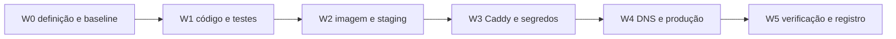

# Plano de implementação: useinfuser.com na VPS

## 1. Estratégia

Preparar e provar a aplicação fora do tráfego público, corrigir os blockers de runtime, instalar a borda sem restart, cortar DNS e verificar o caminho real. Como não haverá subagentes, a execução é sequencial onde há dependência de evidência e paralela apenas em testes independentes de leitura.

## 2. Ownership e superfícies

| Superfície | Paths | Dono | Proteção |
|---|---|---|---|
| Repo do site | lock da work order | Codex | Scope Lock e commits atômicos. |
| VPS app | `/home/infuser/useinfuser-site` | Codex | Release por commit, env 600. |
| Caddy compartilhado | compose + Caddyfile canônicos | Codex | Backup, config validate, reload. |
| DNS Hostinger | apex e `www` | Yan/Codex | Registrar anterior, alterar só os dois. |

## 3. DAG e caminho crítico

**Caminho crítico:** W0 -> W1 -> W2 -> W3 -> W4 -> W5.

| ID | Resultado | Depende de | Onda | Escopo | Gate | Rollback |
|---|---|---|---:|---|---|---|
| W0 | Definição, lock e baseline | nenhum | 0 | specs/.planning | Gate ready | Remover docs antes de código. |
| W1 | Containerização, health, patch e segurança | W0 | 1 | código/dep/deploy | test + build + audit | Reverter commits. |
| W2 | Imagem na VPS e smoke interno | W1 | 2 | VPS app | healthy + rotas | Remover container, manter imagem. |
| W3 | Segredos, rede e Caddy preparados | W2 | 3 | VPS/Caddy | config validada | Restaurar backups. |
| W4 | DNS cortado | W3 | 4 | Hostinger | TLS + caminho real | Restaurar registros anteriores. |
| W5 | Observação, documentação e closeout | W4 | 5 | docs/work order | 15 min sem regressão | W4/W3 conforme sintoma. |

### Serializações deliberadas

| Item | Motivo | Condição que libera |
|---|---|---|
| W2 após W1 | Imagem depende do código e lock aprovados | Build/testes verdes. |
| W3 após W2 | Não tocar a borda com upstream não provado | Container healthy. |
| W4 após W3 | DNS só aponta para borda pronta | Caddy validate e backup. |
| W5 após W4 | Só o caminho real prova deploy | DNS/TLS ativos. |

## 4. Fatias

### W1: runtime reproduzível

- `output: standalone`, Docker multi-stage, Compose hardened, health e smoke.
- patch de Next/Sharp para remover vulnerabilidade crítica do runtime exposto.
- remover long-poll e impor pausa local.
- gate: testes, build, audit e Scope Lock.

### W2/W3: staging na VPS

- transferir env sem imprimir valores;
- construir imagem com BuildKit secret;
- criar rede dedicada e iniciar container sem porta pública;
- testar páginas, auth negativa e webhooks negativos;
- preparar Caddy com backup e validação.

### W4/W5: corte e operação

- alterar apenas apex e `www`;
- confirmar resolução, TLS, release, rotas e logs;
- observar recursos e erros;
- fechar work order e registrar estado no brain.

## 5. Configuração

| Config | Ambiente | Default | Falha segura |
|---|---|---|---|
| `APP_RELEASE` | produção | `unknown` | Health denuncia release desconhecido. |
| `PORT` | produção | `3000` | Container não inicia se ocupado. |
| envs atuais | produção | sem default | Rotas falham fechadas conforme código. |

## 6. Rollout

1. Build e testes locais.
2. Imagem e smoke interno na VPS.
3. Backup de Caddy e DNS anterior.
4. Conectar Caddy à rede dedicada e reload validado.
5. Cortar DNS.
6. Validar apex, `www`, rotas críticas, headers e logs.
7. Observar 15 minutos; abortar em 5xx, health instável ou proteção ausente.

## 7. Rollback

- aplicação: apontar Compose para tag anterior e recriar apenas `useinfuser-site`;
- Caddy: restaurar backup e recarregar após `caddy validate`;
- DNS: restaurar exatamente os valores anteriores;
- dados: nenhum rollback necessário, pois não há migration.

## 8. Matriz requisito para prova

| Requisito | Fatia | Prova | Gate |
|---|---|---|---|
| RF-01 | W4 | DNS/TLS/release | AC-07 |
| RF-02 | W2/W4 | smoke de rotas | AC-03 |
| RF-03/RF-04 | W2/W4 | probes negativos/headers | AC-04 |
| RF-05 | W1 | teste + duração | AC-06 |
| RF-06 | W2-W5 | runbook/tag/backups | AC-08 |
