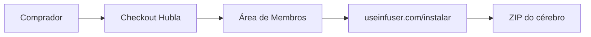

# Arquitetura: entrega do Segundo Cérebro Autônomo

## Contexto

## Componentes

| Componente | Responsabilidade | Falha segura |
|---|---|---|
| Hubla | pagamento, oferta e entrada na área externa | compra sem aprovação não libera o produto |
| Route Handler `/instalar` | servir HTML estático | 500 visível, sem fallback para conteúdo antigo |
| `public/instalar` | CSS, JS, fontes, imagens e ZIP | build falha se ativo faltar |
| VPS/Caddy | TLS e publicação | container anterior permanece no rollback |

## Segurança

- nenhum segredo entra no cliente;
- o guia é público e deliberadamente não autenticado;
- PII dos prints permanece borrada no bitmap;
- Hubla controla a compra e a reentrada no link externo, não o arquivo já baixado;
- links externos são fixos e revisados.

## Fitness functions

- `npm run build` lista `/instalar`;
- todos os ativos referenciados respondem 200;
- ZIP servido tem o mesmo SHA256 do build do produto;
- apex e www passam o smoke;
- rota mobile não gera overflow.
