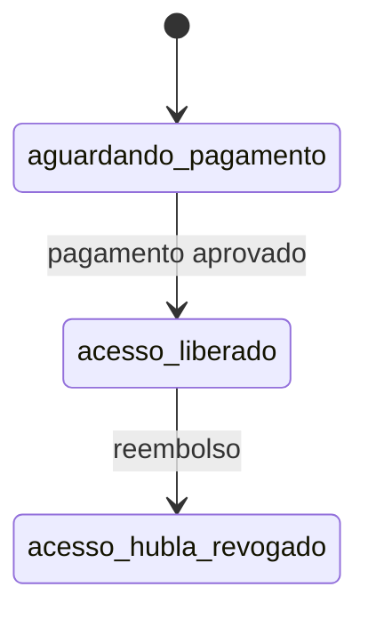

# Contratos e integrações: entrega do Segundo Cérebro Autônomo

## Fronteiras

| Origem | Destino | Contrato |
|---|---|---|
| Hubla pós-compra | Área de Membros | compra aprovada concede acesso nativo |
| Módulo “Comece aqui” | Site Infuser | link absoluto `https://useinfuser.com/instalar` |
| `/instalar` | ativos públicos | caminhos absolutos sob `/instalar/` |
| botão de download | ZIP | `Content-Type` de ZIP e nome `segundo-cerebro-autonomo.zip` |

## Eventos

Não há webhook customizado nesta fatia. Pagamento, acesso e reembolso permanecem sob o contrato nativo da Hubla. Se a Infuser exigir revogação do guia externo, nasce outra fatia event-driven com `invoice.payment_succeeded` e `invoice.refunded`.

## Estado comercial

## Erros

| Código | Significado | Remediação |
|---|---|---|
| HTTP 404 | ativo ou rota ausente | abortar deploy |
| HTTP 5xx | aplicação indisponível | rollback do container |
| preço divergente | oferta errada | não ativar CTA e corrigir na Hubla |
| área vazia | módulo não publicado | não liberar oferta |
