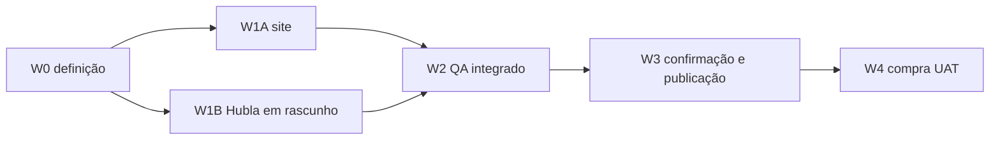

# Plano de implementação: entrega do Segundo Cérebro Autônomo

## DAG

**Caminho crítico:** W0 → W1A + W1B → W2 → W3 → W4.

## Ondas

| ID | Resultado | Depende | Onda | Escopo | Gate | Rollback |
|---|---|---|---:|---|---|---|
| W0 | contrato pronto | nenhum | 0 | `specs/007-*` | EDP ready | apagar pacote antes do build |
| W1A | rota e ativos locais | W0 | 1 | `public/instalar`, `src/app/instalar`, testes | build + browser | remover rota e ativos |
| W1B | produto, oferta e área externa preparados | W0 | 1 | Hubla | revisão antes de ativar | manter inativo ou arquivar rascunho |
| W2 | QA ponta a ponta sem venda | W1A, W1B | 2 | site local + preview Hubla | preço, links, ZIP, mobile | voltar às versões anteriores |
| W3 | site e produto publicados | W2 + confirmação Yan | 3 | VPS + Hubla | smoke externo | tag anterior + desativar produto |
| W4 | compra de teste | W3 | 4 | checkout real | acesso e download | reembolso da compra de teste |

## Serializações

- W3 espera W2 porque publicação altera sistemas externos.
- W4 espera W3 porque só a produção prova o contrato real.

## Configuração

Não há segredo nem variável nova. O domínio e o ambiente de produção existentes são reutilizados.
