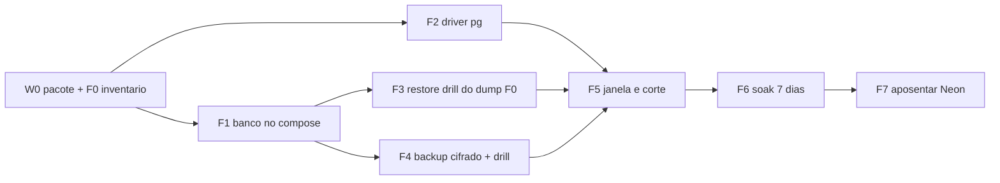

# Plano de implementação: `formulario-db`

## 1. Estratégia

Provar tudo fora do caminho vivo (banco novo, driver novo, restore, backup), cortar numa janela
curta com escrita recusada na borda, e só aposentar o Neon depois de sete dias de soak e de um
restore drill do backup novo. Cada fatia é uma work order própria, com branch e worktree, e o
código de produção só muda em F2 e F5.

## 2. Ownership e superfícies

| Superfície | Paths / lugar | Dono | Proteção |
|---|---|---|---|
| Pacote e work orders | `specs/008-formulario-db-postgres-vps/**`, `.planning/work-orders/WO-FORMULARIO-DB-*.md` | Claude ou Codex | Scope Lock |
| Compose, init, scripts de banco, runbook | `deploy/vps/**` | executor da F1/F4 | Scope Lock; `deploy.sh` nunca faz `down -v` |
| Driver e imports | `src/lib/diagnostico/**`, `src/app/api/diagnostico/mapa/respostas/route.ts`, `scripts/diagnostico/*.mjs`, `tests/diagnostico/**`, `package.json`, `package-lock.json` | executor da F2 | Scope Lock; mutante estático |
| Worker e guard de cadência | `scripts/diagnostico/servico-roteiro.mjs`, `tests/diagnostico/fila-worker.test.ts` | executor da F5 | Scope Lock |
| VPS: env, Caddy, cron, volumes | `/home/infuser/.config/useinfuser/*`, Caddyfile canônico, crontab, `~/backups/formulario/` | executor da F1/F4/F5 com go do Yan | backup timestampado, `caddy validate`, reload, `df` |
| Neon | projeto `formulario-b2b` | Yan | só leitura fora da F5; destruição só na F7 |

## 3. DAG e caminho crítico

**Caminho crítico:** W0 -> F1 -> F4 -> F5 -> F6 -> F7 (F6 tem 7 dias de relógio).

| ID | Resultado | Depende de | Onda | Escopo exclusivo de escrita | Gate | Rollback |
|---|---|---|---:|---|---|---|
| W0 | Pacote `ready-for-build` e inventário F0 | nenhum | 0 | `specs/008/**`, `WO-001` | AC-00, AC-01 | apagar docs |
| F1 | `formulario-db` no Compose: rede, volume, init, role, health, limites, `deploy.sh` subindo o banco | W0 | 1 | `deploy/vps/**` (exceto `validate-env.mjs`), `WO-002` | AC-02 | `docker compose rm -sf formulario-db`; volume fica |
| F2 | módulo `banco.ts` sobre `pg`, 16 imports reapontados, `validate-env` relaxado, `aplicar-schema` completo, `inventariar-banco.mjs`, testes | W0 | 1 | `src/lib/diagnostico/**`, `src/app/api/diagnostico/mapa/respostas/route.ts`, `scripts/diagnostico/*.mjs` (exceto `servico-roteiro.mjs`), `tests/diagnostico/**` (exceto `fila-worker.test.ts`), `deploy/vps/validate-env.mjs`, `package.json`, `package-lock.json`, `WO-003` | AC-03, AC-04 | reverter commits; produção ainda no Neon |
| F3 | restore do dump F0 em container descartável, contagem igual | F1 | 2 | VPS: `~/backups/formulario/`, container e volume temporários; `WO-004` (só evidência) | AC-05 | apagar container e volume de teste |
| F4 | `backup.sh`, `restore-drill.sh`, cron, alerta, primeiro drill | F1 | 2 | `deploy/vps/formulario-db/**`, crontab da VPS, `WO-004` | AC-06 | remover linha do cron |
| F5 | janela: Caddy 503, dump final, restore, contagem, env, deploy, smoke, worker 60 s, reabertura, reconciliação | F2, F3, F4 | 3 | `scripts/diagnostico/servico-roteiro.mjs`, `tests/diagnostico/fila-worker.test.ts`, `deploy/vps/README.md`, env e Caddy da VPS, `WO-005` | AC-07, AC-08, AC-09 | env de volta ao Neon + restart do site + remover bloco |
| F6 | soak 7 dias, Neon `default_transaction_read_only = on` | F5 | 4 | nenhum arquivo; observação e closeout em `WO-005` | AC-10 | rollback da F5 até o 7º dia |
| F7 | revogar role, limpar envs, destruir projeto, remover `@vercel/postgres`, atualizar runbook e mapa | F6 + destino offsite (R1) | 5 | `package.json`, `package-lock.json`, `deploy/vps/README.md`, `specs/008/**`, `WO-006`; VPS env; `.env.local` do Yan; brain | AC-11 | restore do dump cifrado |

Onda 1 roda F1 e F2 em paralelo: escopos de escrita disjuntos, contratos congelados (env em
`CONTRATOS` §3, Compose em `ARQUITETURA` §4.1), cada uma com branch e worktree próprios e sem
tocar o caminho vivo. Onda 2 roda F3 e F4 em paralelo na VPS (F3 é leitura + container
descartável; F4 escreve script e cron), sob a mesma WO-004 porque compartilham
`~/backups/formulario/` e o mesmo operador; se forem executores diferentes, dividir em duas WOs
com o diretório de dumps reivindicado por uma só.

### Serializações deliberadas

| Item | Motivo | Condição que libera |
|---|---|---|
| F3 e F4 após F1 | precisam da imagem pinada, do init e do volume reais | `formulario-db` healthy e `df` registrado |
| F5 após F2 | o site só fala TCP com o driver novo | suíte verde e mutante estático reprovando |
| F5 após F3 | restore "verde" sem contagem é fé | diff de contagem zero no drill |
| F5 após F4 | sem backup do banco novo não se corta | primeiro dump cifrado + drill provado |
| F6 após F5 | soak é relógio | reabertura registrada |
| F7 após F6 e R1 | destruir o Neon sem cópia externa piora o DR | 7 dias limpos + destino offsite definido pelo Yan |

## 4. Fatias e Scope Lock pré-declarado

### F1 (`WO-FORMULARIO-DB-002`, branch `claude/formulario-db-f1`)

- `allowed_write_globs`: `.planning/work-orders/WO-FORMULARIO-DB-002.md`, `deploy/vps/compose.prod.yml`,
  `deploy/vps/deploy.sh`, `deploy/vps/README.md`, `deploy/vps/formulario-db/**`, `specs/008-formulario-db-postgres-vps/**`.
- `architecture_delta.production_files`: `deploy/vps/compose.prod.yml`, `deploy/vps/deploy.sh`,
  `deploy/vps/formulario-db/init/*`; `persistence_surfaces`: volume `formulario-db-data`, rede
  `formulario-net`; `background_jobs`: nenhum; `public_contracts`: nenhum; `runtime_dependencies`: nenhum.
- Entrega: serviço `formulario-db` (`postgres:17.<minor>` pinado após `docker pull` e registro do
  digest), `internal: true`, sem `ports`, secrets de senha admin e app em arquivos 600 criados
  pelo Yan ou pelo executor com go, init de role + banco + `pgcrypto`, `depends_on` no site,
  `deploy.sh` sobe o banco e espera health antes do site. Site ainda com env do Neon.
- Gate AC-02: `docker inspect formulario-db` sem `PortBindings`; `docker network inspect
  formulario-net` só com os dois containers; `pg_roles` da app sem privilégio de cluster;
  `df -h /` antes e depois; `docker compose config --quiet`; site continua healthy no Neon.

### F2 (`WO-FORMULARIO-DB-003`, branch `claude/formulario-db-f2`)

- `allowed_write_globs`: `.planning/work-orders/WO-FORMULARIO-DB-003.md`, `src/lib/diagnostico/**`,
  `src/app/api/diagnostico/mapa/respostas/route.ts`, `scripts/diagnostico/*.mjs` (menos
  `servico-roteiro.mjs`), `tests/diagnostico/**` (menos `fila-worker.test.ts`),
  `deploy/vps/validate-env.mjs`, `package.json`, `package-lock.json`, `specs/008-formulario-db-postgres-vps/**`.
- `architecture_delta.production_files`: os 8 arquivos de `src/` que importam `sql`, o novo
  `src/lib/diagnostico/banco.ts`, `deploy/vps/validate-env.mjs`; `runtime_dependencies`:
  `package.json`, `package-lock.json` (entra `pg` e `@types/pg`; `@vercel/postgres` só sai na F7
  para o rollback da F5 continuar possível por env); `public_contracts`: nenhum;
  `persistence_surfaces`: nenhum; `background_jobs`: nenhum.
- Ordem: teste vermelho (mutante estático + unidade do tagged template) -> `banco.ts` ->
  reaponte dos 8 imports -> `abrirCliente()` nos 8 scripts -> `aplicar-schema.mjs` com 9 `.sql` ->
  `inventariar-banco.mjs` -> `validate-env` com `POSTGRES_URL_NON_POOLING` opcional -> suíte,
  lint, build.
- Gate AC-03/AC-04: `grep -rn "@vercel/postgres\|@neondatabase" src scripts` vazio; testes de
  integração passam com `TEST_POSTGRES_URL` apontando para um `postgres:17` local (e são pulados
  com aviso sem ele); `npm test`, `eslint`, `next build` verdes; o site ainda não é deployado
  com este código (a imagem só troca na F5).

### F3 + F4 (`WO-FORMULARIO-DB-004`, branch `claude/formulario-db-f4`)

- `allowed_write_globs`: `.planning/work-orders/WO-FORMULARIO-DB-004.md`, `deploy/vps/formulario-db/**`,
  `deploy/vps/README.md`, `specs/008-formulario-db-postgres-vps/**`.
- `architecture_delta.background_jobs`: cron `backup-formulario` 03:15; `production_files`:
  `deploy/vps/formulario-db/backup.sh`, `restore-drill.sh`; demais vazios.
- F3: dump do Neon (`pg_dump` 17 via `docker run postgres:17.<minor>`, URL passada por env e
  apagada do histórico), `pg_restore --exit-on-error` num container descartável, diff de contagem
  com o `INVENTARIO-F0.md` (as contagens do vivo podem ter crescido; a prova é origem = destino no
  instante do dump, com `inventariar-banco.mjs` nos dois). Container e volume apagados ao fim.
- F4: `backup.sh` e `restore-drill.sh` conforme `DADOS` §6, cron, alerta, primeiro drill real.
- Gate AC-05/AC-06: diffs zero; `.dump.age` + `.sha256` no diretório 700; `crontab -l` com a
  linha; alerta provado com falha forçada (dir sem permissão) e depois limpo.

### F5 (`WO-FORMULARIO-DB-005`, branch `claude/formulario-db-f5`)

- `allowed_write_globs`: `.planning/work-orders/WO-FORMULARIO-DB-005.md`,
  `scripts/diagnostico/servico-roteiro.mjs`, `tests/diagnostico/fila-worker.test.ts`,
  `deploy/vps/README.md`, `specs/008-formulario-db-postgres-vps/**`.
- `architecture_delta.production_files`: `scripts/diagnostico/servico-roteiro.mjs`;
  `background_jobs`: unit `roteiro` (cadência 60 s); demais vazios. A troca de env e o bloco de
  Caddy são mudanças na VPS, registradas no closeout com timestamps.
- Roteiro da janela em `VERIFICACAO-E-OPERACAO.md` §7.
- Gate AC-07/AC-08/AC-09.

### F6 e F7 (`WO-FORMULARIO-DB-005` para o soak; `WO-FORMULARIO-DB-006` para a aposentadoria)

- F6 não escreve arquivo; observa e registra no closeout da WO-005.
- F7 (`branch claude/formulario-db-f7`): `allowed_write_globs`: `WO-006`, `package.json`,
  `package-lock.json`, `deploy/vps/README.md`, `deploy/vps/validate-env.mjs`, `specs/008/**`;
  `runtime_dependencies`: `package.json`, `package-lock.json` (sai `@vercel/postgres`). Na VPS:
  remover `POSTGRES_URL_NON_POOLING` e as `POSTGRES_*` da Vercel do env; no Yan: limpar
  `.env.local`; no Neon: `default_transaction_read_only` volta, role revogada, projeto destruído;
  no brain: mapa da operação, entidade do funil e pendência fechada.

## 5. Configuração

| Config | Ambiente | Default | Falha segura |
|---|---|---|---|
| `POSTGRES_URL` | produção | sem default | módulo falha no boot; container não fica healthy |
| `POSTGRES_URL_NON_POOLING` | produção | `= POSTGRES_URL` após F2 | aceita ausência |
| `POSTGRES_PASSWORD_FILE` (admin) | container do banco | sem default | container não sobe |
| `db_app_password` (secret) | init do banco | sem default | init aborta, volume vazio pode ser recriado |
| `TZ`, `PGTZ` | container do banco | `UTC` | fixo no Compose |
| `PAUSA_ENTRE_CONSULTAS_MS` | worker | `60_000` após F5 | guard de long-poll continua |

## 6. Rollout

1. F1 e F2 em paralelo, cada uma com WO, branch e worktree; nada em produção muda de comportamento.
2. F3 e F4 na VPS; dumps só em `~/backups/formulario/`.
3. Go do Yan para a F5 com dia e hora (horário morto, sem agendamento no Cal nas 2 h seguintes).
4. F5 conforme runbook; observação de 30 min antes de encerrar a janela como concluída.
5. F6: 7 dias; relatório diário curto no closeout (5xx, alertas, backup, contagem de leads).
6. F7 só com go do Yan e destino offsite definido.

## 7. Rollback

- F1: remover o serviço do Compose e a rede; volume permanece até decisão explícita.
- F2: reverter commits; produção intocada.
- F5 (até a F7): (1) restaurar o env anterior do backup timestampado; (2) `docker compose up -d
  --no-deps site` com a mesma imagem; (3) remover o bloco de janela do Caddy com backup, validate
  e reload; (4) `default_transaction_read_only` volta a `off` no Neon; (5) smoke. Sem dual-write,
  o Neon é exatamente o estado pré-corte. Menos de 5 min.
- F7: restore do `.dump.age` mais recente num `formulario-db` novo; o Neon não existe mais.

## 8. Matriz requisito para prova

| Requisito | Fatia | Prova | Gate |
|---|---|---|---|
| RF-01, RF-02 | F1 | inspect de rede, container e roles | AC-02 |
| RF-03 | F2 | mutante estático + suíte | AC-03 |
| RF-04 | F0, F3, F5 | inventário e diff de contagem | AC-01, AC-05, AC-07 |
| RF-05 | F5 | access log do Caddy, reconciliação Cal e Stripe | AC-07, AC-08 |
| RF-06 | F4 | cron, `.age`, sha256, drill | AC-06 |
| RF-07 | F5 | constante, teste, processo do worker | AC-09 |
| RF-08 | F6, F7 | read-only, envs limpos, projeto ausente | AC-10, AC-11 |
| RNF-01 | F5 | `time_total` da fila | AC-08 |
| RNF-03, RNF-04 | todas | grep de segredo e PII no diff e nos logs | AC-12 |
